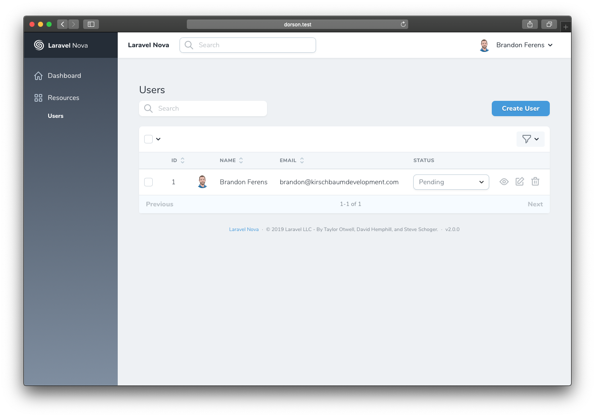

# An inline select field for Nova apps

[](https://packagist.org/packages/kirschbaum-development/nova-inline-select)
[](https://packagist.org/packages/kirschbaum-development/nova-inline-select)

This package contains a Nova select field to that can be updated inline from the index and detail views.




## Requirements

This Nova field requires Nova 2.0 or higher.

## Installation

Next, you can install this package in to a Laravel app that uses [Nova](https://nova.laravel.com) via composer:

```bash
composer require kdg/nova-inline-select
```

## Usage

Next you can use the `Kdg\InlineSelect` field in your Nova resource:

```php
namespace App\Nova;

use Kdg\InlineSelect;

class User extends Resource
{
    // ...
    
    public function fields(Request $request)
    {
        return [
            // ...
            
            InlineSelect::make('Status'),

            // ...
        ];
    }
}
```

Now you can use the `InlineSelect` field just like Nova's `Select` field. Now for the magic... 

## Inline editing

By default, the inline select field works just like a normal select field. To enable the inline editting capabilities we can use the `inlineOnIndex()` and `inlineOnDetail()` methods.

```php
InlineSelect::make('Status')->options($options)
    ->inlineOnIndex()
    ->inlineOnDetails(),
```

Now the above inline select field will show up on both the index a detail views. When making a change to the select field, a button will display next to the field allowing you to commit the change. If you would prefer the field to auto-submit the change, just add `disableTwoStepOnIndex()` or `disableTwoStepOnDetail()`.

```php
InlineSelect::make('Status')->options($options)
    ->inlineOnIndex()
    ->disableTwoStepOnIndex(),displayUsingLabels
```

Now changing the select field on the index view will auto-submit the changed value.

## Display using values

This method works just like Nova's select field. It will display the option value rather than the option key.

```php
InlineSelect::make('Status')->options($options)
    ->displayUsingLabels(),
```

### Testing

``` bash
composer test
```

### Changelog

Please see [CHANGELOG](CHANGELOG.md) for more information on what has changed recently.

## Contributing

Please see [CONTRIBUTING](CONTRIBUTING.md) for details.

### Security

If you discover any security related issues, please email brandon@kirschbaumdevelopment.com or nathan@kirschbaumdevelopment.com instead of using the issue tracker.

## Credits

- [Brandon Ferens](https://github.com/brandonferens)

## Support us

Kirschbaum Development is a web development agency based in Northampton, Massachusetts. You'll find an overview of what we do [on our website](https://kirschbaumdevelopment.com).

## License

The MIT License (MIT). Please see [License File](LICENSE.md) for more information.
